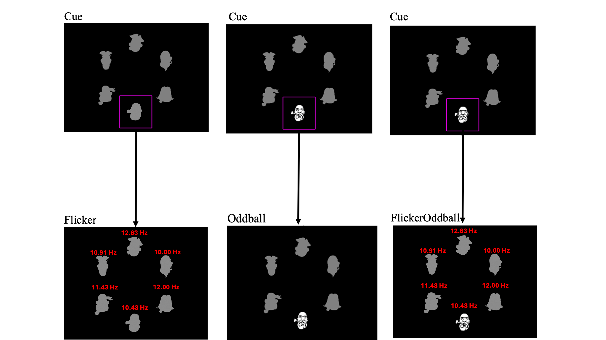
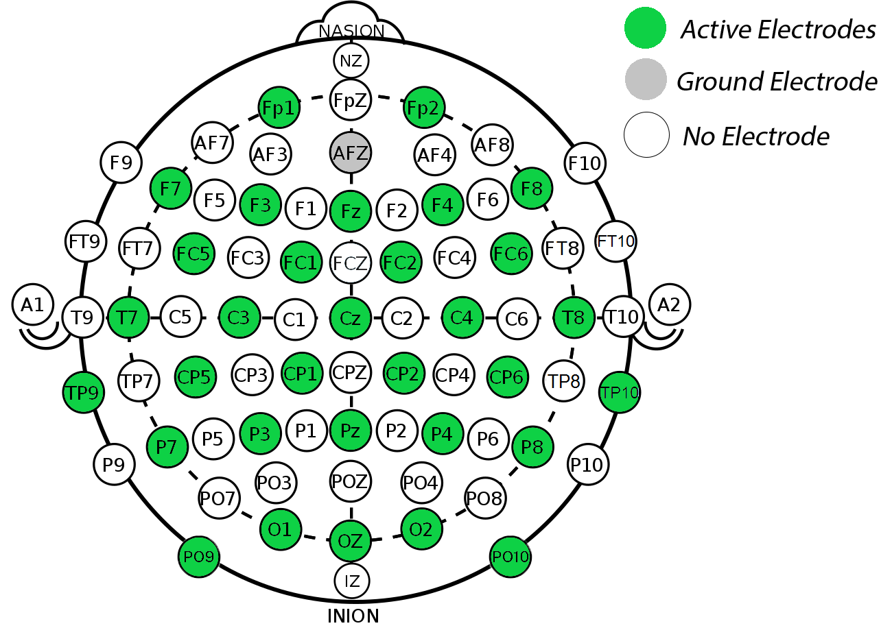

# EEG Dataset Description  

This dataset contains **EEG recordings from 10 participants** who performed three tasks:  

| Task             | What it Measures            | What You Can Do |
|------------------|-----------------------------|-----------------|
| **Oddball**      | Event-Related Potentials (ERPs, e.g. P300) | Classify **target vs. non-target** trials |
| **Flicker**      | Steady-State Visual Evoked Potentials (SSVEPs) | Identify the **attended frequency** |
| **FlickerOddball** | Hybrid of ERPs + SSVEPs   | Classify **target vs. non-target** with flickering |

👉 Your challenge: build a **data cleaning pipeline** and/or a **machine learning model** for one or more of these tasks. You don’t need to do everything — even focusing on one task, a subset of participants, or just preprocessing is fine. Creativity counts!  

---

# 📥 Download the Data  

- **Data files:** [Download link](https://ncilnas.psychology.dal.ca:5001/sharing/elOuhz5LW) (password: `SURGE-brainhack-F25`)  
- Each participant × task = one `.fif` file with **raw EEG + event markers**.  
  - See [resources](#dataset-structure-example) for dataset structure.
- A starter notebook ([`Offline_Stream_Example_Notebook`](example-scripts/Offline_Stream_Example_Notebook.ipynb)) shows how to load and visualize the data with [MNE-Python](https://mne.tools/stable/index.html).  

---

# ⚡ Quick Info  

- **Participants:** 10 (IDs: 10–16, 19–21)  
- **EEG:** 32 channels (10–20 montage), average referenced  
  - See [Electrode layout](#resources) for montage details
- **EOG:** 1 channel (⚠️ noisy, avoid for ML)  
- **Sampling rate:** 1000 samples/second (Hz)
  - At each channel! That's 32,000 data points per second.
- **Stimuli:** Cartoon faces in 6 positions around fixation  
  - Each stimulus has an index [0-5], starting from the top, moving clockwise. These correspond to the markers.
- **Frequencies (Hz):** 10.00, 10.43, 10.91, 11.43, 12.00, 12.63  
  - Used only for `Flicker` and `FlickerOddball`

---

# 🧪 Tasks & Triggers 

1. **Block:** Participant instructed to attend to one target location (6 blocks per task)  
2. **Trial:** Definition varies by task (see below)  

<p align="center">
  
</p>

---

### Oddball – ERPs (P300, N170, VPP)
- **Procedure:**  
  - White face at one location (500 ms) → gray silhouettes (250 ms) → next trial  
  - ISI = 750 ms  
- **Trials per block:** 60 (10 target, 50 non-target)

**Trigger codes:**  
- `Oddball/block_X/target/loc_Y` → target stimulus at location Y  
- `Oddball/block_X/nontarget/loc_Y` → non-target stimulus  
- `Oddball/block_X/block_end` → block finished  

---

### Flicker – SSVEPs
- **Procedure:**  
  - All 6 faces flicker at distinct frequencies for 30 s  
  - Participant attends to one frequency/location for the whole block (6 blocks total)
- **Trials per block:** 1 (continuous 30 s trial)  

**Trigger codes:**  
- `Flicker/block_X/freq_Y/block_start` → start of block (attend frequency Y Hz)  
- `Flicker/block_X/freq_Y/block_end` → end of block  

---

### FlickerOddball – Hybrid (SSVEP + ERPs)
- **Procedure:**  
  - All faces flicker continuously  
  - One face highlighted white (500 ms) → then gray (250 ms)
  - ISI = 750 ms  
- **Trials per block:** 60 (10 target, 50 non-target)

**Trigger codes:**  
- `FlickerOddball/block_X/target/loc_Y/freq_Z` → target stimulus at location Y (flickering at Z Hz)  
- `FlickerOddball/block_X/nontarget/loc_Y/freq_Z` → non-target stimulus  
- `FlickerOddball/block_X/block_end` → block finished  

---

# 🎯 What You’ll Work On  

- **Oddball & FlickerOddball:** classify **targets vs. non-targets** (ERP and/or SSVEP features)  
- **Flicker:** classify **which frequency** participants attended (SSVEP features)  

### Tips:
- **We don't expect you to do everything!** You can focus on just one task or one aspect or part of the dataset (e.g., only some participants, only SSVEP, only data cleaning, only feature extraction, etc.). Remember, creativity counts!
- Use the provided **[`Offline_Stream_Example_Notebook`](example-scripts/Offline_Stream_Example_Notebook.ipynb)** to get started with loading and visualizing the data.
- Use **preprocessing techniques** (artifact removal, filtering) to get clean signals for classification.
  - Check out the [**MNE-Python documentation**](https://mne.tools/stable/index.html) for EEG data processing and analysis techniques.
- **Justify your approach.** You can use any ML model, preprocessing, or feature engineering methods, but you must explain your choices. 
- If you’d rather ask your own research question with the dataset, go for it!  

---

# Resources  

### Dataset Structure Example:

```
📂 eeg_data
├── 📂 Flicker
│ ├── 📄 sub-010_task-Flicker_eeg.fif
│ ├── 📄 sub-011_task-Flicker_eeg.fif
│ ├── 📄 sub-012_task-Flicker_eeg.fif
│ └── ...
├── 📂 Oddball
│ ├── 📄 sub-010_task-Oddball_eeg.fif
│ ├── 📄 sub-011_task-Oddball_eeg.fif
│ ├── 📄 sub-012_task-Oddball_eeg.fif
│ └── ...
├── 📂 FlickerOddball
│ ├── 📄 sub-010_task-FlickerOddball_eeg.fif
│ ├── 📄 sub-011_task-FlickerOddball_eeg.fif
│ ├── 📄 sub-012_task-FlickerOddball_eeg.fif
│ └── ...  
```

### Electrode layout: 
  

### Frequency locations:

| **Index** | **Frequency (Hz)** |
|----------|------------------|
| 0        | 12.63           |
| 1        | 10.00           |
| 2        | 12.00           |
| 3        | 10.43           |
| 4        | 11.43           |
| 5        | 10.91           |