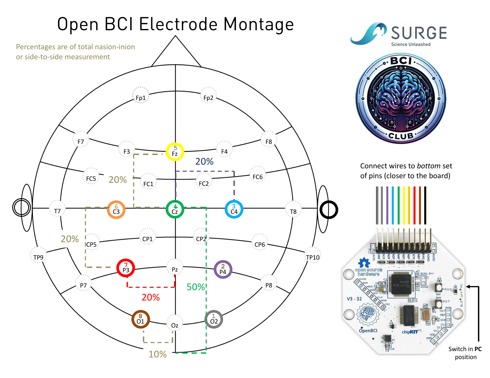

# Real-Time EEG Stream: Setup Instructions  

This guide provides resources to help you set up **real-time EEG data acquisition** for your BCI project.

---

## Prerequisites
Before you begin, ensure you have:  
- **Python** installed, preferably using the provided `Brainhack` environment.  
  - **See [python_setup.md](../resources/python_setup.md) for installation instructions.**  
- **OpenBCI GUI** (optional but useful for real-time EEG visualization).  
  - Download from the [OpenBCI website](https://openbci.com/downloads).  

---

## **OpenBCI Cyton Board Setup**  

We have **5 [OpenBCI Cyton boards](https://docs.openbci.com/Cyton/CytonLanding/)** available for use during the hackathon.  

📖 **Refer to the** [Cyton "Getting Started" Guide](https://docs.openbci.com/GettingStarted/Boards/CytonGS/) **for full setup instructions.**  

### **Step 1: Connect and Power the Cyton Board**
1. Connect the **dongle to your laptop** (ensure it's detected in Device Manager or equivalent). 
2. Insert **AA or rechargeable batteries** and turn the Cyton board **ON**.   
3. Open the **OpenBCI GUI** and verify that EEG signals are streaming correctly.  

### **Step 2: Streaming EEG Data in Python**
To stream data from the Cyton board using Python, see:  
📄 **[OpenBCI Realtime Example Notebook](./example-scripts/OpenBCI_Realtime_Example.ipynb)** in `example-scripts/`.  

---

## Electrode Placement & Montage
We have provided a standard Cyton montage, optimized for common EEG-based BCIs.
However, you may need to adjust the electrode placements depending on your project (e.g., P300, SSVEP, Motor Imagery).

**Example Adjustments:**
- **SSVEP:** Place electrodes at O1, O2, and POz for visual cortex signals.
- **P300:** Use Pz, Cz, and Fz for event-related potentials.
- **Motor Imagery:** Position electrodes around C3 and C4 for movement-based BCIs.

### Standard Cyton Montage:

---

## Next Steps:
- Run the OpenBCI GUI to verify data streaming.
- Use the provided Jupyter notebook to start processing real-time EEG data.
- Integrate EEG signals into your application (P300, SSVEP, MI, etc.).

Happy Hacking!